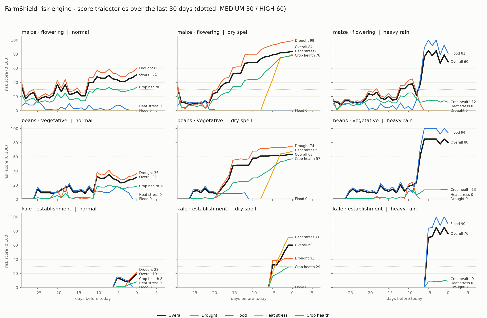

# FarmShield AI

**Hyperlocal climate risk infrastructure for smallholder farmers in Kenya.**
Built for JHUB Africa *Hack the Weather 2026* - theme "From Data to Impact".

Farmers do not need raw forecasts; they need answers: *Should I irrigate today? Is my maize in a drought-risk window? Can this weather event trigger my insurance?*
FarmShield turns weather station readings + crop + growth stage + location into an explainable **Farm Risk Score**, stage-aware advice (English + Kiswahili, via SMS) and parametric **insurance trigger signals**, then exposes all of it through a clean REST API for insurers, banks, SACCOs and agribusinesses.

```
FARM RISK SCORE
Drought Risk      🔴 HIGH
Flood Risk        🟢 LOW
Heat Stress       🔴 HIGH
Crop Health       🔴 POOR
Overall  85 / 100  — HIGH CLIMATE RISK        insurance trigger: TRIGGERED (21-day rain 0.4 mm < 30 mm)
```

## Quick start

```bash
make setup      # venv + pip + npm install
make dev        # API on :8000, dashboard on :5173
```

Windows without GNU make:

```powershell
.\dev.ps1 setup
.\dev.ps1 dev
```

Copy `.env.example` to `backend/.env` and fill in keys. Everything degrades gracefully without them.

- Dashboard: http://localhost:5173
- API docs: http://localhost:8000/docs
- Docker (optional): `docker compose up --build` serves the dashboard on :8080 and the API on :8000.

## Architecture

```
                 ┌──────────────────────────────────────────────────────────────────┐
                 │                         FarmShield AI                            │
 Farmer          │                                                                  │
 (phone, crop,   │  ┌──────────────┐    ┌─────────────────────────────┐             │
  planting date, │  │ FastAPI      │───▶│ Climate Risk Engine         │             │
  location)      │  │ /farms       │    │ engine/ (stdlib only)       │             │
 ───────────────▶│  │ /scenario    │    │  crops.py   thresholds+Kc   │             │
                 │  │ /alerts      │    │  stages.py  growth stage    │             │
 JKUAT Conduit   │  └──────┬───────┘    │  scoring.py 4 sub-scores    │             │
 weather station │         │            │             + reasons       │             │
 ───────────────▶│  WeatherProvider ───▶│  insurance.py triggers      │             │
 (mock replay    │  (conduit | mock)    └──────────────┬──────────────┘             │
  for the demo)  │                                     │ RiskAssessment             │
                 │  SatelliteProvider (NDVI stub) ─────┘  + TriggerResult           │
 Satellite NDVI  │                                     │                            │
 (stretch) ─────▶│         ┌───────────────────────────┼─────────────────┐          │
                 │         ▼                           ▼                 ▼          │
                 │  Advisor (Gemini 3.1        SQLite via SQLAlchemy   SMS sender   │
                 │  flash-lite, rule-based     farms, readings,        (Africa's    │
                 │  fallback) EN + SW          assessments, alerts     Talking /    │
                 │                                                     console)     │
                 └────────┬────────────────────────────┬────────────────────┬───────┘
                          ▼                            ▼                    ▼
              React dashboard              Partner API  /api/v1        SMS to farmer
              (farmers, demo)              X-API-Key: insurers,        (<= 160 chars,
                                           banks, SACCOs, agribiz      EN or SW)
```

Repo layout:

```
backend/app/engine/     pure-Python risk engine (no FastAPI, no DB, no network) - unit-tested
backend/app/providers/  WeatherProvider (conduit, mock) and SatelliteProvider (stub)
backend/app/services/   assessment pipeline, advisor (Gemini + fallback), sms, alerts dedupe
backend/app/routers/    farms, risk, alerts, partners (/api/v1), scenario switch
frontend/               Vite + React + Tailwind dashboard, Recharts, Leaflet
docs/                   frozen openapi.json, issue specs, engine_validation.png
notebooks/              sample-data generator + engine validation plot
```

## Scoring methodology (why a farm scores 72)

Scoring is deterministic and rule-based. Every constant lives in [`backend/app/engine/crops.py`](backend/app/engine/crops.py) with its agronomic source, and every point awarded comes with a human-readable reason that the API and the UI both show.

**Inputs.** Last 30 days of daily readings (rainfall, max/min temperature, humidity, soil moisture, solar radiation), crop, planting date, optional NDVI. Only readings since planting count towards crop stress.

**Growth stage** from planting date and the crop calendar (FAO-56 stage lengths, KALRO maize / bean guides). Each stage carries a crop coefficient Kc, a water need in mm/week (Kc x ETo 4.5 mm/day x 7 for Juja/Thika), a 0-1 yield-sensitivity weight (highest at flowering / grain-fill, following FAO-33 yield-response factors) and a waterlogging sensitivity.

| Sub-score | Evidence (max points) | Stage scaling |
|---|---|---|
| **Drought** | 7-day rainfall deficit vs stage need (40) · cumulative deficit since planting (25) · soil moisture below stress / wilting point (25) · consecutive dry days (10) | x 0.7-1.2 by stage sensitivity |
| **Flood** | 24 h and 72 h totals vs crop heavy-rain thresholds (45 + 45) · soil at saturation (15) · rainfall intensifying (10) | x 0.7-1.2 by waterlogging sensitivity |
| **Heat** | days above the crop threshold in the last 7 (60, tighter limit at flowering) · hot days over the month (15) · degrees over threshold (15) · low humidity (10) | x 0.7-1.2 by stage sensitivity |
| **Crop health** | NDVI if available (0.60 = dense, 0.35 = sparse); otherwise 0.55 drought + 0.30 heat + 0.15 flood, scaled by days in the ground | GOOD / FAIR / POOR |

**Levels.** 0-29 LOW, 30-59 MEDIUM, 60-100 HIGH.
**Overall** = max(stage-weighted mean, 0.85 x worst sub-score). Weights: critical stages drought 40 / heat 30 / flood 10 / health 20; establishment drought 30 / flood 30 / heat 20 / health 20; otherwise 35 / 20 / 25 / 20. A single HIGH hazard is never averaged away by three LOW ones.

**Insurance triggers** ([`insurance.py`](backend/app/engine/insurance.py)): drought = cumulative rainfall over `window_days` below `rainfall_threshold_mm`; excess rain = any rolling window above the threshold; heat = N days above T°C. Optional `critical_stages_only` gate. Confidence = data completeness x margin from threshold. Evidence is returned with every decision.

Validation over the three demo scenarios (`python notebooks/engine_validation.py`):

| scenario | maize / flowering | beans / vegetative | kale / just planted |
|---|---|---|---|
| normal | 48 MEDIUM | 31 MEDIUM | 20 LOW |
| dry_spell | 85 HIGH · trigger fires | 85 HIGH · trigger fires | 60 HIGH |
| heavy_rain | 68 HIGH (flood 80) | 81 HIGH (flood 95) | 76 HIGH (flood 89) |



## How to demo (2 minutes)

Before the pitch: `make dev`, open http://localhost:5173, make sure the header shows **Normal**. Optional: `cd backend && python -m app.seed --reset` for a clean database.

1. **Dashboard** - three Juja farms, three different scores from the same weather: maize at flowering MEDIUM, beans MEDIUM, kale just planted LOW. "Same station, different risk - because stage matters."
2. **Open Kamau Maize Plot** - the FARM RISK SCORE panel. Read one reason aloud: *"Only 13 mm rain in the last 7 days vs 38 mm/week needed at flowering."* Toggle the advice to Kiswahili.
3. **Flip the header to Dry spell** - every farm re-assesses; the maize score animates to 85 HIGH, drought and heat go red, the insurance trigger flips to TRIGGERED, the advice changes to "irrigate within 24-48 hours, hold fertiliser".
4. **Send SMS alert** - preview shows the exact <= 160-character message, then send (console or Africa's Talking sandbox). Send again to show the dedupe policy holding a duplicate.
5. **Flip to Heavy rain** - drought collapses, flood goes HIGH, the kale seedlings are now the most exposed farm.
6. **For insurers & banks** - pick `acme-insurance`, fire `GET /api/v1/risk/1` and show the JSON with reasons; switch to the invalid key to show the 401; run the bulk portfolio call; run `check-trigger` with `critical_stages_only` to show the stage gate.
7. **Register farm** - add a tomato plot by clicking the map; it gets a score immediately.

Talking points: no black box (every number has a reason and a cited threshold); infrastructure, not an insurer (partners integrate in one call); works today on the mock station and switches to live JKUAT Conduit data with one env var.

## API walkthrough (mock provider)

Everything below runs against the bundled Juja readings, no keys needed. Start the API with `make api`
(or `make dev`), then in another shell:

```bash
B=http://localhost:8000
K="X-API-Key: fs_demo_acme_insurance_2026"   # demo partner key (also: fs_demo_harvest_sacco_2026)

# 1. Health + the three seeded demo farms (maize/flowering, beans/vegetative, kale/just planted)
curl -s $B/health
curl -s $B/farms | python3 -m json.tool

# 2. Register a farm (07xx numbers are normalised to +2547xx). Runs a first assessment immediately.
curl -s -X POST $B/farms -H 'Content-Type: application/json' -d '{
  "farmer_name": "Grace Njeri", "phone": "0722000010", "language": "en",
  "farm_name": "Njeri Tomatoes", "crop": "tomatoes", "planting_date": "2026-07-20",
  "lat": -1.105, "lon": 37.015, "area_ha": 0.3 }'

# 3. The Farm Risk Score for the maize plot, then re-assess it under a dry spell (per-call override)
curl -s $B/farms/1/risk | python3 -m json.tool
curl -s -X POST "$B/farms/1/assess?scenario=dry_spell" | python3 -m json.tool
#   -> overall.level HIGH, insurance_trigger.triggered true, advice.en / advice.sw, advice.source "fallback"
#      (becomes "gemini" once GEMINI_API_KEY is set)

# 4. Weather the score was based on, and the assessment history
curl -s "$B/farms/1/weather?days=7"
curl -s "$B/farms/1/risk/history"

# 5. SMS alerts: preview the exact <=160-char message, send it, try again (deduped), list history
curl -s -X POST $B/farms/1/alerts/preview | python3 -m json.tool
curl -s -X POST $B/farms/1/alerts/send      # sent: true,  reason: first_alert (console prints the SMS)
curl -s -X POST $B/farms/1/alerts/send      # sent: false, reason: duplicate_within_window:6h
curl -s -X POST $B/farms/1/alerts/send -H 'Content-Type: application/json' -d '{"force": true, "language": "en"}'
curl -s $B/farms/1/alerts

# 6. Live-demo switch: flip every farm to heavy rain, re-assess, and alert farmers whose level changed
curl -s -X PUT $B/scenario -H 'Content-Type: application/json' -d '{"scenario": "heavy_rain", "reassess": true, "notify": true}'
curl -s -X PUT $B/scenario -H 'Content-Type: application/json' -d '{"scenario": "normal"}'

# 7. Partner API (insurers / banks / SACCOs) - X-API-Key required
curl -s -i $B/api/v1/risk/1 | head -1                 # 401 {"detail": "Missing X-API-Key header"}
curl -s -H "X-API-Key: nope" $B/api/v1/risk/1         # 401 {"detail": "Invalid or inactive API key"}
curl -s -H "$K" $B/api/v1/me
curl -s -H "$K" $B/api/v1/risk/1 | python3 -m json.tool
curl -s -H "$K" "$B/api/v1/risk/bulk?farm_ids=1,2,3"  # portfolio roll-up + per-farm results
curl -s -X POST -H "$K" -H 'Content-Type: application/json' $B/api/v1/insurance/check-trigger -d '{
  "farm_id": 1, "scenario": "dry_spell",
  "policy": {"type": "drought", "window_days": 21, "rainfall_threshold_mm": 30, "critical_stages_only": true} }'
#   -> triggered true, rule drought_rainfall_deficit, evidence.rainfall_total_mm 0.4
```

### Graceful degradation

| Dependency | Missing / down | Response |
|---|---|---|
| Gemini (`GEMINI_API_KEY`) | key unset, SDK missing, timeout, bad JSON | rule-based EN + SW advice, `advice.source: "fallback"`, HTTP 200 |
| Africa's Talking (`SMS_SENDER=africastalking`) | key unset, SDK error, gateway down | SMS printed to console, alert stored with `source: "fallback"`, HTTP 200 |
| JKUAT Conduit (`WEATHER_PROVIDER=conduit`) | URL unset, timeout, unparsable payload | mock readings, `data_sources: ["mock:<scenario> (conduit unavailable)"]` |

Alert policy (`services/alerts.py`): no SMS for LOW risk unless an insurance trigger fired; no repeat within
`ALERT_DEDUPE_HOURS` (default 6) unless the overall level changed or a trigger newly fired; `force: true` always sends.

Run `make openapi` after changing any schema to refreeze `docs/openapi.json` for the frontend client.

### Connecting the JKUAT Conduit station

Set `WEATHER_PROVIDER=conduit` and `CONDUIT_API_URL` (plus `CONDUIT_API_KEY` if needed) in `backend/.env`. The adapter in
[`providers/weather/conduit.py`](backend/app/providers/weather/conduit.py) expects `GET {URL}/readings?lat=&lon=&days=` and maps
common field names (`temperature`, `rainfall`, `humidity`, `soil_moisture`, `solar_radiation`, `wind_speed`, `timestamp`) via
`FIELD_ALIASES`, aggregating sub-daily records to daily. **The real payload shape is still an assumption** - adjust `FIELD_ALIASES` /
`_parse` once the station's response is known. Failures fall back to the mock replay and are logged.

## Tests

```bash
make test        # backend: engine (59), API (15), alerts (14)
cd frontend && npm run build && npx oxlint src
```

## Work breakdown

| # | Area | Issue | PR |
|---|------|-------|----|
| 1 | Data Science - Climate Risk Engine | [#1](https://github.com/Millie-source/FarmShield-AI/issues/1) | [#4](https://github.com/Millie-source/FarmShield-AI/pull/4) |
| 2 | Backend - API, pipeline & integrations | [#2](https://github.com/Millie-source/FarmShield-AI/issues/2) | [#5](https://github.com/Millie-source/FarmShield-AI/pull/5), [#6](https://github.com/Millie-source/FarmShield-AI/pull/6) |
| 3 | Frontend - Farmer dashboard & partner demo | [#3](https://github.com/Millie-source/FarmShield-AI/issues/3) | [#7](https://github.com/Millie-source/FarmShield-AI/pull/7) |

## Integration checklist

- [x] `feat/engine` merged: `backend/app/engine` green under pytest
- [x] `feat/backend` merged: curl walkthrough passes against mock provider
- [ ] `feat/frontend` merged: demo path clickable in under 2 minutes
- [x] `docs/openapi.json` frozen and frontend client matches
- [ ] Conduit station adapter wired to the live endpoint (waiting on the station payload)
- [ ] `backend/.env` keys set (Gemini, Africa's Talking sandbox)
